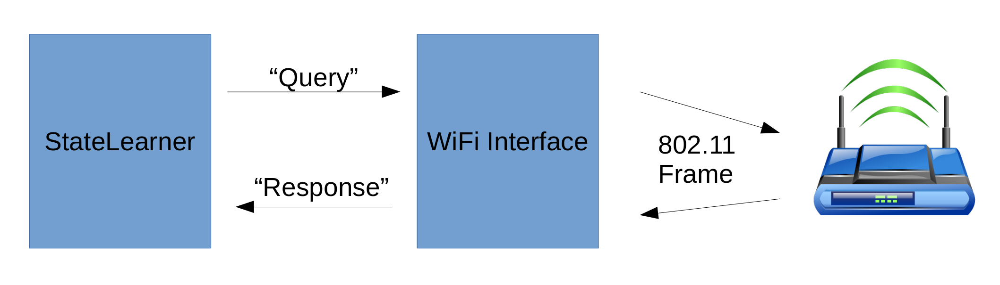

# Overview

WiFi learner is split into two separate components, the WiFi Interface and the StateLearner. StateLearner systematically builds abstract queries and sends them to the WiFi interface. Here, the abstract queries are turned into concrete 802.11 WiFi frames which are then transmitted to the target Access Point. The interface then observes the responses and converts them into an abstract output that can be fed back to the StateLearner. Using these responses, the StateLearner gradually builds up the state machines implemented by the AP. This process is illustrated below. 

Instructions on how to set up and use each component can be found at the links below:

- [WiFi Interface](https://chrismcmstone.github.io/wifi-learner/interface-tool.html)
- [StateLearner](https://chrismcmstone.github.io/wifi-learner/learner-tool.html)